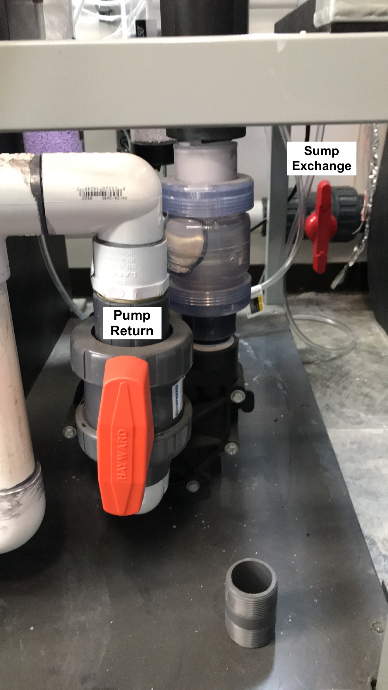

# Start-up Guide

**Contents**  
- [**Basic Operation**](#Basic_Operation)  
- [**Filtration**](#Filtration)  
- [**Water Changes**](#Water_Changes)  
- [**Sump Flow**](#Sump_Flow)  
- [**Mesocosm Tank Flow**](#Meso_Flow)  
- [**CO2 Scrubber**](#CO2_Scrubber)  
- [**Draining the Meso and Sump**](#Draining_Sump)

 **Basic Operation**

1. Operating water level in the filtration sump should be 7" in the filter cell compartment.
1. Overflow water from the tanks will feed down to the outside underground sump pump, then into to the filtration skid inside the Citrus Hall Field Room.  The water will flow through mesh filters and be pumped through carbon filters, the UV sterilizer, and chiller, then back to the tanks.

 **Filtration**

* Biological and Mechanical Filtration: Water from the Mesocosm tanks is pumped into the sump by passing through 6 mesh filters.  These filters have an accumulated biofilm to biologically filter the water before it enters the sump.
* Chemical and Mechanical Filtration: Water in the sump is pulled through the three carbon filters with mesh filter sleeves by a pump and pushed up into the UV sterilizer, where is is then directed through the chiller chamber.

 **Water Changes**

1. Collecting seawater
    1. The water collected for the mesocosm system is filtered (100um mesh filter) unbuffered seawater from SCMI (Southern California Marine Institute located at 820 S Seaside Ave, San Pedro, CA 90731).
    1. At least 24 hours before collecting water, email Mark Loos (mark.loos@csulb.edu) of your intent to get water, and give him an estimated time of arrival.
    1. Sign out the Ford 450 truck at the Bio Stock Room for your desired day.
        1. Before driving a univeristy vehicle, be sure to complete the Defensive Drivers course.  Email Wendy Dunbarr (wendy.dunbarr@csun.edu) for details.
    1. Once you pick up the truck, back it up to the large stacked square bins in the same parking lot, near the side of the building on the grass.
        1. With the help of a willing victim/volunteer, lift and push the top bin into the bed of the truck.  Take off the lid of the second bin and lift the second bin onto the bed of the truck. Once in place, put the lid back on.  (Lids at ~15lbs of weight, so make it easier on yourself and just remove it before lifting)
    1. Plan to leave for SCMI after 9am to avoid major traffic, and wear or bring closed toed shoes to wear once you arrive.
    1. When you arrive at SCMI, pull into the employee lot (the parking lot to the left of the building) and back up to the lot behind the building parallel to the wire fence
        1. Move the cone before backing into the lot and replace the cone when you leave.
    1. To the left of the wire fence walkway to the docks, there's a large pool hose with a pvc loop attachment.  Move the end of the hose to the drain port (hole in the concrete flowing under the walkway), and open the t-valve at the base of the hose (open = t-valve is in line with the PVC).
    1. Walk over to the filtration area in the corner of that lot and open the t-valve on the PVC that is running to the filter chamber (large tan cylinder with round top).  That PVC pipe runs from the filter chamber toward the wire fence.
    1. From where you turned the t-valve, look to the wire fence and notice a power box with a large flip switch.  Turning this switch ON will initiate flow from the marina, through the filter, and out the end of the pool hose.
    1. Flip the switch to ON and leave the water running for 30 seconds to 1 minute to flush out any standing water in the system.
    1. When you're ready to fill the containers, use the PVC loop on the hose to hang it over the side of the container for hands-free filling and wait.
        1. If you're filling up the entire mesocosm system, you will need to fill both bins about 3/4 full twice (two trips to and from SCMI).
        1. If you're only doing a water change or refill, fill up as much as you need, and a little more to make sure you have enough.
    1. When you're done filling, **first turn off the power supply**, then close the t-valve (turn so the valve is perpendicular to the PVC) on the pipe going to the filter chamber, and finally close the t-valve at the hose.
        1. CLosing off either of the other t-valves could cause a pressure build-up in the PVC and may rupture the system.
    1. Place the lids on the water containers and use rope/line or ratcheting line to secure the bin lids down (this will help with water spillage on the drive back to CSUN).
 1. Filling the sump
    1. Once back at CSUN, pull into the laoding bay between Citrus and Eucalyptus, and back up toward the Field Room, leaving just enough space to open the door.
    1. Unstrap and remove the lids.  Place one end of the large pool hose in one of the containers, and use a weight to keep it from floating up.
    1. Pull the free end of the hose to the sump, and start a siphon.  Gently wedge the end of the hose into the mesh filters in the sump for a. hands-free siphoning and b. filtering the water as it goes into the system.
    1. When you're ready to switch bins, maintain the siphon by cupping the palm of your against the hose end, moving that hose to the next bin, then removing your hand once submerged.
    1. If you're collecting water again, simply replace the lids, and drive back to SCMI for another round.
    1. Once you're done emptying the bins, attach the garden hose (stored next to the secondary sump) to the fresh water tap on the outside of the Field Room, and turn on water by using the metal screw key hanging on a pipe just inside the Field Room to the left, next to the outlets.
    1. Hose down the entire back, bed, and sides of the truck, everything that may be touched by salt water.
    1. Place the large pool hose back in the bins, and once you turn off the hose water, replace the garden hose and key to where you found them.
    1. Before parking the truck, back it up to the same location where you picked up the bins, and drop/place the bins back on the grass.  If there is any water left in the bins, dump that out before leaving them. stacked.

 **Sump Flow**

1. Preparing for flow in the sump
    1. Before turning on the pump to initiate flow, make sure the t-valves are aligned to direct flow where it needs to go.
    1. The meso return valve should be vertical in the "closed" position (perpendicular to the PVC), and the sump return valve should also be vertical in the "open" position (in line with the PVC).
        1. See Figure 1 to identify valves
    1. The pump return valve should be veritcal in the "open" position to allow flow from the sump through the pump up to the UV filter and chiller compartments.  See Figure 2.
    1. The two UV flow valves and the chiller bypass valve should all be vertical.  This directs flow down through the UV light before returning up to the chiller chamber.  See Figure 3.  
      
      
      
1. Turning on sump flow
    1. Once all the valves are properly opened/closed as described above, plug in the Cascade Pump and make sure water is running through the system properly without any leaks.  There may be some initial sputtering while air is pumped out of the pipes, but that should stop within a couple minutes.
    1. Look at the pump and make sure you can see water being pushed through the clear junction.
        1. If it looks like water is not running through the pump for some reason, **unplug the pump immediately**.  Running the pump dry can burn out the motor.
    1. If everything seems to be stable, plug in the UV light.
    1. To stabilize the pH in the system, fill and plug in the CO2 scrubbers as [detailed below](#CO2_Scrubber).

 **Mesocosm Tank Flow**

1. Filling the mesocosm tanks 
    1. Make sure the drain valve located under each tank is closed (turned clockwise all the way, finger-tight).
    1. Open the N flow valve for each tanks (and S flow valve if you're turning the Solenoid ON to fill the tanks).
    1. To open flow from the sump to the tanks, first make sure the circular flow within the sump itself is stable.  Then slowly open the meso return valve (turn counterclockwise) until the t-valve is sitting about 45 degrees to the PVC pipe.  This splits flow to both the sump and now the mesocosm.  You can further adjust water pressure to the tanks by turning the sump return valve slightly to direct more flow to the meso, less flow to the sump, while always keeping the line to the sump partially open.
    1. Fill each rack one at a time (only open the N flow valves for one set of 4 tanks at a time) and make sure rack and filtration skid flows are balanced before moving on to the next rack.
    1. Make sure the complete system reaches equilibrium in standard recirculation mode before setting up the tidal cycle.
1. Set flow in tanks
    1. Calculate your desired residence time.  When full, each tank holds 55 liters, so divide 55L by your desired residence time and use that estimated value as your flow rate.  Example: for a RT of 8 hours: 55L/8hr = 6.88 L/hr or 114.67 mL/min
    1. If you have an acceptable range for your residence time, set flow rate to within that range, as close to your desired flow as possible.  Example: for a RT of 7.5-8.5 hours: RT = 6.47-7.33 L/hr or 107.83-122.17 mL/min
    1. Use the Neptune Systems flow meters as a guide for setting the flow, but for the most accurate flow rates, use a graduated cylinder to estimate flow into each tank.
    1. Flow will slightly change throughout the day, so it is recommended to set flow twice per day: once in the morning and once in the afternoon/evening.

 **CO2 Scrubber**

1. Replacing media in the Phosban Reactor
    1. Unplug the airpump connected to the Phosban Reactor and disconnect both sets of tubing going into/out of the Reactor tube to easily remove and work wtih the Reactor tube.
    1. Unscrew the lid of the Reactor, take off the red cap and black mesh, and pour out the used up media (purple if freshly used up, grayish white if used and stale) into a bag or some containment.
    1. Use tape or parafilm to cover the hole of the small tube inside the Reactor before pouring in the new media (stark white pellets).  Fill to an inch **below** the top of the small tube, so no media falls into the tube.  Remove the covering from the small tube and replace the black mesh and red cap, aligning the red cap so it encapsulates the small tube.
    1. Screw the lid back on, finger tight, and replace the tube on the side of the sump.  Reconnect the tubing from the airpump to the side of the Reactor tube and from the air splitter to the front of the tube.
    1. Once you're sure everything's securely placed, plug in the air pump.
    1. Listen and feel for any air leaks and adjust tubing as necessary.

 **Draining the Mesocosm and Sump**
1. The first step before draining any water is to turn off the powerheads, heaters, and CO2 bubblers in all mesocosm tanks. **The powerheads and heaters cannot be on when dry or they will be damaged**.
1. You must also place caps on each pH probe filled with either DI water for temporary storage or KCl storage solution for long-term storage.  **The probe tips cannot dry out or they will be damaged**.
1. When draining the tanks, drain one rack of 4 tanks at a time, to not overflow the drainage system.
1. Water flow
    1. If you intend to only drain the mesocosm tanks, but not the sump, then turn off the flow from both the N and S valves into the tank, turning both clockwise, then remove the PVC tubing as described below. If needed, divert excess water into the secondary sump following the [steps below](#), and disregard the rest of these draining instructions.
    1. If you intend to drain the sump as well to fully shut down or clean out the system, then maintain high flow through the N valve into all tanks.  Continue following this set of instructions.
1. Divert flow from the sump to the drainage port
    1. We need to stop flow of water from the mesocosm tanks to the sump and divert this water to a drainage port (there is a drain in the Mechanical room behind the Field Room with PVC pipe facing downward inside.  This PVC is connected to our system and will be the location of drainage)
    1. Refer to Figure 1. for t-valve identities.
    1. **First open the System Drain Valve** by turning the valve so it aligns parallel to the PVC.  This opens flow to the drainage port in the back room.  Always open an avenue of flow before closing an avenue of flow to avoid back pressure build up.
    1. Second, close the Meso to Sump Valve by turning the valve so it sits perpendicular to the PVC.  This will stop incoming water from the mesocosm from entering the sump and will divert all flow out of the system.
1. Open tank drains
    1. Under each tank is a needle valve controlling drain flow through the smaller PVC tubing in each tank.  Fully open this valve for the rack of 4 tanks, turning the needle counterclockwise.
1. Pulling out the PVC drainage tubing
    1. In each of the four tanks, **unscrew** the larger PVC tube until it is fully removed and water in the tank can drain out from the lowest point in the tank.
    1. The smaller PVC tube can be pulled out from its slot, sometimes needing to be twisted to be unwedged.
    1. Tanks with both PVC removed will drain faster.
1. The sump pump located in the ground between the Mesocosm container and the Field Room will funcition normally to push water from the tanks to the Field Room system, but as we drain large volumes of water, periodically check to make sure water isn't overflowing out of the ground sump pump.
1. Also periodically check on the drainage port to make sure the water being pumped in from the tanks isn't overflowing onto the floor.
    1. If you notice the water is overflowing, slightly open the Meso to Sump valve to divert some water back into the sump and reduce the water volume diverted to the drainage port.
    1. **We cannot let salt water overflow onto the floor of the Mechanics room**
1. Sump flow
    1. Unplug the UV light and CO2 scrubbers, but leave the pump on for now.
    1. Allow the sump to continue pumping water from the main reservoir into the tanks, where the water will continuously drain out of the system.
    1. Once the water level in the sump is about an inch or two below the top of the carbon filters (the three white cylinders inside the sump), unplug the Pump.  **The pump must be turned off before it runs dry, otherwise the pump will be damanged**
    1. At this point there will still be some water left in the sump, which can either be siphoned out and dumped into the drainage port, or you can use a small aquarium pump to pump out the water in the main reservoir, the bio-filtration reservoir, and the 50-micron mesh reservoir.
    1. **Be cautious to not let this pump run dry either, or it may be damaged**
    1. To access the bio-filtration reservoir, remove the black and blue mesh filters, and bring them outside to clean by hosing down with freshwater.
    1. To access the 50-micron mesh reservoir, remove the PVC tubing located directly after the Meso to Sump Valve (see Figure 1) by unscrewing the PVC at the junction.  The PVC with three outports can be temporarily removed, so the mesh can be taken out and also sprayed down to clean.
1. Post-drainage
    1. Once the system is fully drained of seawater, screw back on the PVC at the junction by the Meso to Sump Valve and screw in or wedge in each tank's PVC tubes back in place.
    1. Follow the instructions [above for filling the sump](#Filling_the_sump) and the order of operations for turning flow back on.
    1. You will not have to plug in the UV light or CO2 scrubbers since you are not maintaining any water chemistry, but rather just flushing the system.
    1. Let fresh water run through the system for a couple days before folling these same steps for draining the freshwater.