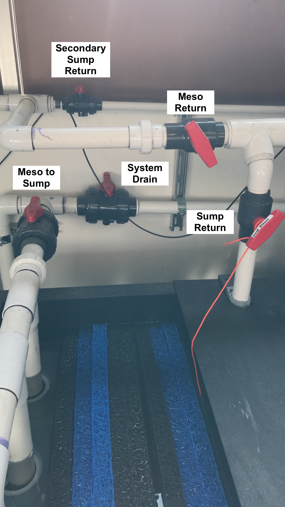

# System Operation Guide

**Contents**  
- [**Preparation inside the Mesocosm**](#Preparation)  
- [**Filtration**](#Filtration)  
- [**Sump Flow**](#Sump_Flow)  
- [**Mesocosm Tank Flow**](#Meso_Flow)  
- [**Overflow into Seconday Sump (tidal cycling)**](#Overflow_into_Secondary_Sump)  
- [**CO2 Scrubber to Elevate pH**](#CO2_Scrubber)  
- [**Daily Checks of Sump and Tank Operation**](#Daily_Checks)  
- [**Draining the Meso and Sump**](#Draining_Sump)  

 **Preparation inside the Mesocosm**  

1. Examine all 20 tanks to make sure each tank has each necessary component:
  * 1 Submersible powerhead pump
  * 1 200 W Heater
  * 1 Light
  * 1 Temperature probe (Apex, short black slender probe with rubber tip. **Do not attempt to remove rubber tip.**)
  * 1 pH probe (Apex, long blue slender probe with sensitive glass electrode tip, tip stored in KCl solution in removable clear rubber cap)
  * 1 Conductivity probe for every set of four tanks (Apex, long black slender probe) 
  * 1 air stone and tubing to bubble CO2
  * 1 Overflow drain port PVC
  * 1 Controlled drain port PVC (~ 1/2 tank height)
  * For a complete list of all items associated with each tank, view the [System Details chapter](03-system_details.md).
1. Remove the long black conductivity probe and blue pH probe from each tank in preparation for [calibrating the probes](#probe_calibrations). These two probes can dangle gently next to the tank until you begin the calibrations. To keep organized, dangle each probe to the right of its respective tank. **Keep the clear cap on the pH probe until you begin the calibration. The glass electrode tip must not dry out**
1. Once all tanks are equipped with the above items, make sure:
    1. The two PVC pipes are in place (screw in the large pipe, just finger tight; wedge in the shorter pipe).
    1. The two in-flow tubes are threaded through the holes on the front black lid holders.
    1. The acrylic lid is placed on top of the four black lid holders and steady.
    1. The black needle valve for at least the N flow port (the primary continuous inflow port) is fully opened (turned counter-clockwise) with a half turn back closed (clockwise).  At this point you can also open the S flow port (the solenoid-controlled inflow port) the same way as the N flow port.  
        1. N flow ports are always the 'inner' ports, while S flow ports are always 'outer' ports for each tank couplet.
    1. The black needle valve for the D flow port (the outflow port for the short outflow pipe, located underneath each tank) is fully closed (turned all the way clockwise, just finger-tight). This ensures the tanks will fill completely initially.
1. To fill the system with seawater, follow the [water collection guide](06-water_collection.md).
    1. As the sump is being filled, keep eyes on the water level to make sure the sump will not overflow
    1. Once the water level is at least 2 inches above the three carbon filters, turn on the main sump pump to just circulate flow within the sump (refer to the water collection guide for exact positioning of the t-valves for this configuration.)
    1. Once the water level of the sump is about 2/3 full, slowly open flow to the mesocosm tanks (again, refer to the [water collection guide](06-water_collection.md) for exact positioning. Do not fully open or fully close any valves when redirecting flow to the mesocosm tanks.)
1. Frequently walk between the mesocosm tanks and the sump to make sure there are no spills or leaks, and that every tank is filling, while also making sure the water level in the sump is not falling too low (should not reach the carbon filters) or too high (should not rise much above the matala filters). 
    1. Before or while the mesocosm tanks are filling, you can also log into ApexFusion and turn ON flow from the S port (via SOL-TNK-# on the home dashboard for each Apex). [Directions for navigating ApexFusion are here.](12-apex_fusion_guide.md)
1. Once all tanks are mostly or completely filled, begin positioning tank elements on the walls of each tank (suction cups often will not hold well enough until submerged in water).
    1. Place the heater horizontally along the back wall, with the power head along this same wall off to one side, not touching the heater. **For tidal cycling, both the heater and powerhead should be below the top of the small PVC.**
    1. Place the temperature probes along any wall where the value will not be skewed (not directly next to the heater, but near the powerhead can be a good location)
    1. Once the pH and conductivity probes have been calibrated, these can also be stuck along the wall, following similar guidelines to the temperature probe. **For tidal cycling, the temp, pH, and conductivity probes should all be placed with probe tips below the top of the small PVC.**
1. Once the tanks are completely filled, turn ON the powerheads via [ApexFusion](apexfusion.com).
1. Full tanks with continuous inflow will drain out through the tall wide PVC pipe (back left) and pour into the ground well behind the container. The pump in this ground well will pump water to the sump using a float switch. Monitor this pump to make sure it is periodically pumping water back to the sump. If this pump fails, refer to the [troubleshooting guide](14-troubleshooting_guide.md) to replace the pump.
1. Plug in the UV light as the final filtration unit for the system.
1. Make sure there is a CO2 cylinder inside the mesocosm container (if planning to manipulate pH) and that the tank is connected to the system with the Tunze valve (image below).
    1. 
1. The system is now ready for manipulative experiments.

 **Sump Flow**  

1. Preparing flow in the sump
    1. Before turning on the pump, make sure the correct channels of flow are opened to direct the water where it needs to go.
    1. The Meso Return valve should be vertical in the "closed" position (perpendicular to the PVC), and the Sump Return valve should also be vertical in the "open" position (in line with the PVC). See [Figure 1](#Figure1) to identify valves.
    1. The Pump Return valve should be vertical in the "open" position to allow flow from the sump through the pump to the UV filter and chiller compartments. See [Figure 2](#Figure2).
        1. If you do not intend to utilize the Secondary Sump at this time, close the Sump Exchange valve (as shown in [Figure 2](#Figure2) )
    1. The two UV Flow valves and the Chiller Bypass valve should all be vertical.  This directs flow down through the UV light chamber before pushing through to the chiller compartment.  See [Figure 3](#Figure3).  
    
      
    
      
    
      
1. Turning on sump flow
    1. Once all the valves are properly opened/closed as described above, plug in the Cascade Pump and make sure water is running through the system properly without any leaks.  There may be some initial sputtering while air is pumped out of the pipes, but that should stop within a couple minutes.
    1. Look at the pump and make sure you can see water being pushed through the clear junction.
        1. If it looks like water is not running through the pump, **unplug the pump immediately**.  Running the pump dry can burn out the motor.
    1. If everything seems to be stable, plug in the UV light.
    1. To stabilize the pH in the system, fill the PhosBan Reactors with CO2 absorption media and plug in the air pumps as [detailed below](#CO2_Scrubber).

 **Mesocosm Tank Flow**  

1. Filling the mesocosm tanks 
    1. Make sure the drain valve located under each tank is closed (turned clockwise all the way, finger-tight).
    1. Fill each rack one at a time (only open the N flow valves for one set of 4 tanks at a time) and make sure rack and filtration skid flows are balanced before moving on to the next rack.
        1. Open the N flow valve for each tank (and S flow valve if you plan to turn on the solenoid [SOL-TNK-#] to help fill the tanks).
    1. To open flow from the sump to the tanks, first make sure the circular flow within the sump itself is stable.  Then slowly open the Meso Return valve (turn counterclockwise) until the t-valve is sitting about 45 degrees to the PVC pipe.  This configuration splits flow to both the sump and the mesocosm.  You can further adjust water pressure to the tanks by slightly closing the Sump Return valve to direct more flow to the meso, less flow to the sump, while always keeping the line to the sump partially open. 
    1. Once all tanks are filled, make sure the whole system is stable in standard recirculation mode before setting up a tidal cycle, if desired.
1. Set flow in tanks
    1. Calculate your desired residence time.  When full, each tank holds 55 liters, so divide 55L by your desired residence time and use that estimated value as your flow rate.  Example: for a RT of 4 hours: 55L/4hr = 13.75 L/hr
    1. Use the Neptune Systems flow meters as a guide for setting the flow, but for the most accurate flow rates, use a graduated cylinder to estimate flow into each tank.
        1. Using the example above: 13.75 L/hr = 229.2 mL/min = 38.2 mL/10 seconds to efficiently check each tank's flow using a graduated cylinder
    1. While higher flow is more stable, lower flow may change slightly throughout the day, so it is recommended to check and set flow twice per day: once in the morning and once in the afternoon/evening.

 **Overflow into Secondary Sump**  

If you need to contain more water in the system than the tanks and main reservoir can hold at one time (ex. during a "low tide event" when half of the tank water is drained into the sump), then you will need to incorporate flow to and from the secondary sump.  

1. First unplug the sump's main water pump to make sure the pump will not run dry if the water level drops too low.
1. Open the Secondary Sump Return valve ( [Figure 1](#Figure1) ), so that the t-valve runs parallel with the PVC. Filtered sump water will then be simultaneously directed into the mesocosm and the secondary sump, via PVC tubing that diverts water into the top of the secondary reservoir.
1. To then open flow between both the main holding reservoir and the secondary sump, open the Sump Exchange valve ( [Figure 2](#Figure2) ), so the t-valve runs parallel with the PVC.
    1. This pipe will allow water to flow between both reservoirs, establishing water level equilibrium.
1. If you have not already filled the mesocosm tanks, make sure the black needle valve for the D flow port (the outflow port for the short outflow pipe, located underneath each tank) is fully opened (turned all the way counterclockwise, and then one half turn back). The goal is to only fill the tanks to the halfway point ('low tide' level).
    1. If you have filled the mesocosm tanks completely, fully open the D flow port as described above and reduce flow from the N and S inflow ports to initiate an ebb tide event (drains tank halfway).
    1. Periodically check on the sump water level to make sure the sump will not overflow, though this is unlikely if the Sump Exchange Valve is opened (see above).
1. The black needle valve for the N flow port (the primary continuous inflow port) should be partially opened (turn counter-clockwise to open). Leave the S valve closed completely (turned clockwise, just finger tight).
    1. This configuration allows the tank to fill to the 'low tide' level, but not exceed this level, as long as the flow in is less than flow out through the small PVC pipe.
1. When filling the sump reservoirs (by just filling into the main reservoir), fill the main reservoir to just below the overflow gate to the matala filters (blue and black mesh).
1. Follow remaining details for [System Preparation](#Preparation) and [Sump Flow Preparation](#Sump_Flow) before continuing to ensure all flow channels are appropriately setup.
    1. Make sure the heater, powerhead, and probe tips are all below the top of the short PVC pipe to ensure submersion during a 'low tide' level.
    1. Make sure the water level in the main reservoir is still at least 2 inches above the carbon filters before turning on the main sump pump.  If not, add more seawater to the system until the carbon filters are once again submerged **to avoid the pump running dry**.
    1. The full system requires ~ 400 gallons of sea water to maintain tank volume and submersion of carbon filters while including use of the secondary sump.
    

 **CO2 Scrubber to Elevate pH**  

1. Filling/Replacing media in the Phosban Reactor
    1. Unplug the airpump connected to the Phosban Reactor and disconnect both sets of tubing going into/out of the Reactor to easily handle it.
    1. Unscrew the lid of the Reactor, take off the red cap and black mesh, and pour out the used up media (purple if freshly used, grayish white if used and stale) into a bag or some other containment. Used media can be deposited in a standard trash receptacle.
    1. Use tape or parafilm to cover the hole of the small tube inside the Reactor before pouring in the new media (stark white pellets).  Fill to **an inch below** the top of the small tube, so no media falls into the tube.  Remove the covering from the small tube and replace the black mesh and red cap, aligning the red cap so it encapsulates the top of the small tube.
    1. Screw the lid back on, finger tight, and replace the Reactor on the side of the sump.  Reconnect the tubing from the airpump to the side of the Reactor and from the air splitter to the front of the Reactor.  Submerge the airstones connected to the air splitter tubing in the holding reservoir of the sump.
    1. Once you're sure everything's securely placed, plug in the air pump.
    1. Listen and feel for any air leaks and adjust tubing as necessary.

 **Daily Checks of Sump and Tank Operation**  

While the system is powered on and cycling water through the sump and mesocosm tanks, there are certain operations and parameters that should be checked for daily.  This is a basic list of items that should be assessed, although you may need to incorporate additional items depending on your experimental design.  

1. Is sump level normal (2 inches above white carbon filters)?
    - If no, immediately unplug the Cascade pump and UV light to avoid damage
    - Troubleshooting:
        - Is the outside sump pump functioning? Did water overflow out of the hole?
        - Are any of the mesocosm tanks overflowing?
1. Is there any overflow of water from the mesocosm tanks?
    - If yes:
        - Check outflow pipe blockage
        - If water is being siphoned from any tanks via the tubing and lid holder, wipe off tank edges (particularly undernear the black holders) to dry off and stop the siphoning action
1. Is there adequate flow to tanks (visual check)?
    - Lift up each tube enough to make sure there is relatively decent flow (for your needs) in each tank
    - If no, is there inadequate flow in one tank or all tanks?
        - One tank: need to increase flow via needle valve
        - All tanks: may need to increase flow to mesocosm from the sump
    - Using a stopwatch and graduated cylinder, measure flow rate from each tube and adjust as necessary using the needle valve above each tube
1. Is the dehumidifier full?
    - The dehumidifier tray should be emptied every day to avoid humidity buildup and condensation on electronics
1. Are the tank parameters within range?
    - Using handheld probes for temperature, salinity, and pH, each tank should be checked for parameter values (log these values)
    - If values read by the handheld probes do not match values read by the apex (see the Apex Fusion Guide), recalibrate the incorrect probes
    - If handheld probes and apex are both showing values outside of your desired range, check the apex programming (see Apex Programming Guide and Apex Fusion Guide)
        - Adjust programming as necessary
        - If programming is correct, check if instruments have failed
            - Temperature: check heater fail or poor plug connection
            - pH: check if air stones (aka bubblers) are dosing or 'leaking' CO2. May need to adjust pressure on the CO2 tank to avoid CO2 pressure in tubing forcing CO2 through the solenoids if pH is too low
            - Salinity: may need to schedule a water collection day to refresh the system water if salinity values are too high

 **Draining the Mesocosm and Sump**  

1. The first step before draining any water is to turn off the powerheads, heaters, and CO2 solenoids in all mesocosm tanks. **The powerheads and heaters cannot be ON when dry or they may be damaged**.
1. You must also place caps on each pH probe filled with either DI water for temporary storage or KCl storage solution for long-term storage.  **The probe tips cannot dry out or they will be damaged**.
    1. Remove the probe from its holder in the tank, rinse in DI, then carefully slide the DI-filled cap on the probe tip until the diode is fully submerged.
1. Divert flow from the mesocosm tanks to the drainage port
    1. There is a drain in the Mechanical Room behind the Field Room with PVC pipe facing downward inside.  This PVC is connected to our system and is the location for all system drainage.
    1. Refer to [Figure 1](#Figure1) for the following t-valve identities.
    1. **First open the System Drain Valve** by turning the valve so it aligns parallel to the PVC.  This opens flow to the drainage port in the back room.  Always open an avenue of flow before closing an avenue of flow to avoid back pressure build up.
    1. Second, Close the Meso To Sump valve by turning the valve so it sits perpendicular to the PVC.  This will divert flow from the mesocosm tanks out of the system.
1. Fully open (parallel to the PVC) the Sump Return valve of the filtration system, then turn off the flow of both the N and S valves for each tank, turning the valves clockwise until finger tight.
1. Unplug the UV light and air pumps, but leave the water pump on for now.
1. When draining the tanks, drain one tank at a time, to not overflow the drainage system.
    1. **Unscrew** the larger outflow pipe until it is fully removed and cover the top opening with your hand to avoid water splashing upward when you remove the pipe.
    1. Under each tank is a needle valve controlling drain flow through the smaller outflow pipe in each tank.  Fully open this valve by turning the needle counterclockwise until partially open.
    1. The smaller outflow tube can simply be pulled out from its slot, sometimes needing to be twisted to be unwedged.
1. The underground sump pump located between the Mesocosm container and the Field Room will continue to push water from the tanks to the Field Room system.
    1. **Do not allow salt water to overflow the drainage port of the Mechanics room.** Periodically check the drainage port to make sure the water pumped from the tanks is not overflowing onto the floor of the Mechanical Room.
    1. By only draining one tank at a time, overflow should not be an issue.
    1. If you notice water is overflowing, slightly open the Meso To Sump valve to divert some water back into the sump and reduce the water volume diverted to the drainage port.
1. Once the mesocosm tanks are all drained, unplug the sump's main pump.
    1. **Alternatively**, to drain the sump partially, leave the main pump plugged in, open the N flow valves for mesocosm tanks, then slightly open the Meso Return valve, and slightly close the Sump Return Valve.
    1. Water will flow from the sump to the tanks, then out through the drainage port.
    1. Once the water level in the sump is 1-2 inches above the three carbon filters, open the Return Sump valve, then close the Meso Return valve, then unplug the sump's main pump.
1. Remove filters from the sump
    1. To access the bio-filtration reservoir, remove the black and blue matala mesh filters, and clean them by hosing them down with freshwater (available just outside the Field Room door).
    1. To remove the 50-micron mesh filters, remove the PVC pipe located directly after the Meso To Sump valve (see [Figure 1](#Figure1)) by unscrewing the PVC at the junction (unscrew away from you if standing at the head of the sump).  This PVC pipe with three outports can be temporarily removed, so the mesh can be taken out and also sprayed down with fresh water to clean.
    1. Remove the three carbon filters from the main reservoir by gently twisting and tugging until they come away, and hose them down outside with fresh water.
1. To drain the sump, use a small aquarium pump to pull water out of the sump into buckets that can be drumped down the drainage port in the back room
    1. Attach tubing to the aquarium pump and place both the pump and tubing end into the main reservoir of the sump.
    1. Plug the aquarium pump into the quad outlet behind the sump (where the sump pump and UV light had previoiusly been plugged in).
    1. Use the tubing to fill up a bucket with remaining sump water, and place the tubing end back into the sump when dumping the bucket.
    1. Do this until the water level is such that the aquarium pump is no longer a viable option.       1. **Do not let this pump run dry, or it may be damaged**
1. Place the tubing and aquarium pump in the bio-filtration reservoir and continue the process, stopping before the pump runs dry.
    1. Any additional water can be removed with a small bucket or large sponge.
1. Once the system is drained of seawater, place the filters back into the sump (3 50um mesh, 8 bio-filters, and 3 carbon filters).
1. Clean the mesocosm tanks thoroughly.
    1. Remove any debris or algal grwoth
    1. Wipe off all probes (avoiding sensitive tips), tubes, heaters, and sides of the tanks
    1. Use a brush to clean inside the large and small outflow pipes
    1. Thoroughly clean the powerheads (remove the plastic head and magnetic turbnine within to clean all areas of each unit, removing algal growth and debris)
1. Screw back on the PVC pipe with three outports at the junction by the Meso To Sump valve.
1. Fill the sump with fresh water.
    1. Follow the instructions in the [Water Collection Guide for filling the sump](06-water_collection.md) with fresh water (attach a hose to the water pipe next to the Field Room door and fill the sump from the hose) and the order of operations for turning flow back on through the sump and tanks.
    1. You will not have to plug in the UV light or air pumps since you are not maintaining any water chemistry, but rather just flushing the system.
    1. Place the hose in the front most compartment of the sump (where the three 50um mesh filters sit, to let the fresh water go through this compartment, into the second compartment and then overflowing into the main reservoir.
    1. While the sump main reservoir fills to about halfway, open the N and S flow valves for all the tanks.
    1. Once the sump is halfway full, partially open the Meso Return valve and partially close the Return to Sump valve.
    1. Plug in the sump main pump.
        1. Fresh water from the sump will flow through the sump pipes and into the mesocosm, flushing out the internal plumbing, and then from the tanks, into the underground sump, and out through the drainage port. Flush the system in this way for ~ 20 minutes, leaving the hose on to continuously refill the sump.
        1. Make sure the sump is not filling up too quickly (avoid overflowing) or draining too quickly (avoid the water level dropping below 1-2 inches above the three carbon filters)
    1. After the system has flushed through, re-place each mesocosm tank's outflow pipes (screw in the large pipes and wedge in the small pipes), and then close the D valve below each tank.
    1. Open the Meso to Sump valve and close the System Drain valve.
    1. Allow all tanks to completely fill with fresh water, and once the tanks are full and the sump is filled halfway, turn off and remove the freshwater hose.
1. Let fresh water run through the system for one to two days before following these same steps for draining the freshwater.
1. End of experiment
    1. Remove the water inflow tubes from each tank's N and S ports to be acid washed and rinsed in DI water before next use.
    1. Rinse all pH, conductivity, and temperature probes in DI water.
    1. Use a KCl storage solution for capping the pH probes, ensuring the probe tips are fully submerged in the solution.

