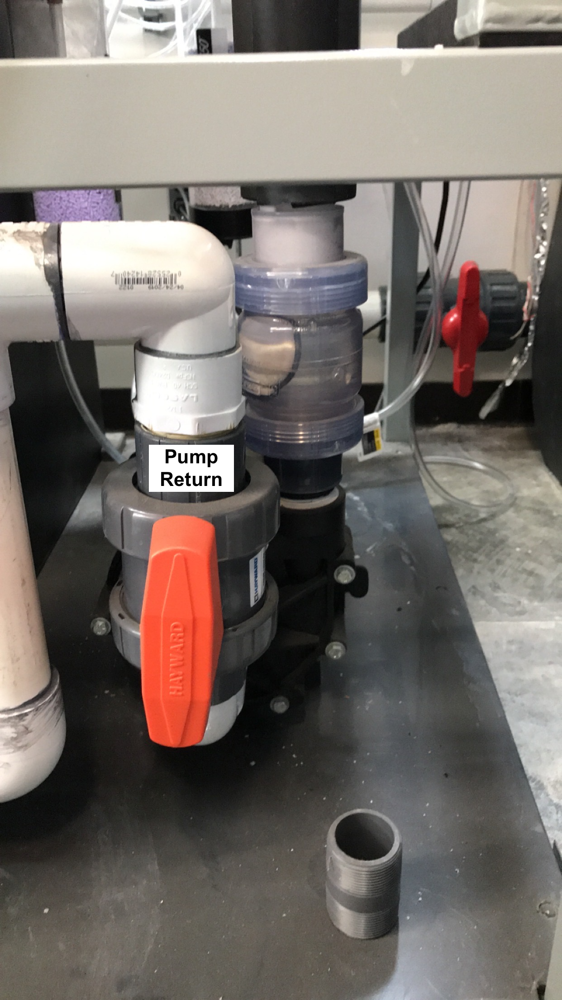

# Water Collection Procedures

The water collected for the mesocosm system is filtered (100um mesh filter) unbuffered seawater from the Southern California Marine Institute (SCMI) located at 820 S Seaside Ave, San Pedro, CA 90731.

**Contents**  
- [**SCMI Packing List**](#packing_list)  
- [**Pre-Collection Check List**](#check_list)  
- [**Water Flow Procedure**](#water_flow)  
- [**Water Collection**](#water_collection)  
- [**Filling the Sump**](#filling_the_sump)  

 **SCMI Packing List**  

1. Items to bring to SCMI for collecting water
    1. Two large water storage bins and lids
    1. Pool hose (stored inside one of the water bins)
    1. Triple filter (5, 20, and carbon filters) and filter stand set up
        1. each of the attachments you will need are on the filter stand
    1. Locking ring (white tightening loop)
    1. Two ratchet straps or sets of rope (usually in 440 Truck) to be used in case of emergency
    1. Empty seawater carbouys if needed

 **Pre-Collection Check List**  

1. Before traveling
    1. Sign out the Ford 440 truck at the Bio Stock Room for your desired day (Biology Department Vehicle ID 440).
        1. Before driving a university vehicle, be sure to complete the Defensive Drivers course.  Email Wendy Dunbarr (wendy.dunbarr@csun.edu) for details.
    1. At least 24 hours before collecting water, email Mark Loos (mark.loos@csulb.edu) and cc Julianne Steers (Julianne.Steers@csulb.edu) of your intent to get water, and give them an estimated time of arrival. Check in with them upon arrival. 
    1. Check that all three o-rings of the triple filter are in place and that the filters are placed in order (left to right following direction of flow: 20um, 5um, carbon filter) before twisting the filters onto the base rack.  Use the locking ring to ensure a tight seal of the filter compartments onto the rack.
    1. Ensure that all components of the sump are prepared for water:
        1. Three bag filters are in place
        1. Eight matala filters are in place
        1. Three carbon filters are in place, the open PVC end wedged into the holes of the PVC located in the back of the holding tank
        1. If you do not intend to use the secondary sump, close the Sump Exchange valve (see image below)
        1. Check that all power cords are away from areas with possible water exposure
    
    
                
1. Once you pick up the truck from behind Chaparral Hall, back it up to the large stacked square bins in the same parking lot, near the side of the building on the grass.
    1. With the help of at least one other person, lift and slide the top bin into the bed of the truck.  Take off the lid of the second bin and lift the second bin onto the bed of the truck. Once in place, put the lid back on (lids weight an additional 15-20lbs).
1. Make sure you have all the items listed above loaded in the truck to bring to SCMI.
1. Plan to leave CSUN for SCMI around 6 am or after 9 am to avoid major traffic, and wear or bring closed toed shoes to wear once you arrive.
1. When you arrive at SCMI, back into the employee lot (the parking lot to the left of the building when looking on from the street), back through the lot and behind the building parallel to the wire fence.
    1. Move the cone before backing into the lot behind the building and replace the cone when you leave.
    1. Check in with someone (either Mark or Julianne) at the office if there are any updates to the system before starting to get water. Sometimes they will set things up for you.

 **Water Flow Procedure**  

1. Near the wire fence, there is a large pool hose with a pvc loop attachment. Remove the banjo attachment comprising of the PVC "U" on the pool hose and attach the banjo adapter that connects to the triple filter. Before connecting it to the filter, move this end of the hose to the drain port (hole in the concrete flowing under the walkway).
1. Current order of operations as of August 2022 is:
    * Open the t-value sewage line located in the [front of the building](images/SCMI_SewageLineLocation.png) by around 15 degrees as seen [here](images/SCMI_SewageValve.png). 
    * Open the t-valve at the base of the pool hose **half-way (at a 45 degree angle)**
         * Reference image for t-valve alignment:
    
       
    * T-value near power switch. Walk over to the filtration area in the corner of the back lot (near the fish pens) and locate the filter chamber (tall teal cylinder with rounded top).  Open the t-valve for the PVC pipe running from the base of the filter chamber toward the wire fence (see image below). The pipe should be covered by purple tape. 
    * Turn power on only after opening all the t-values. There is a power switch (also with purple tape) on the fence across from the filter's PVC (second power unit from the right). Turning this switch ON will initiate flow from the marina, through the filter, and out the end of the pool hose. **Do not turn on the power supply until you have opened the other t-valves.** Doing so could cause pressure buildup in the piping and damage the system.
    * Flip the switch ON and leave the water running for 30 seconds to 1 minute to flush out any standing water in the system.
    * Turn off switch and place pool hose on triple filter and then turn system back on *

      

 **Water Collection**  

1. Place the plastic tubing at the  outflow end of the triple filter inside on of the bins (or carbouy). You will need to remove or offset the bin lids.
1. When you have finished flushing out the system and are ready to fill the bins, turn off the power supply without closing off any of the t-valves.
1. Attach the banjo adapter to the triple filter (see image below), then turn on the power supply again. This will initiate flow through the filters and into the bins. To avoid pressure build-up in the system, allow the SCMI garden hose to continuously pump water into the drain port or the adjacent ocean. Make sure the hose is not spraying any equipment on the deck. 

      

1. Filling the bins
    1. If you are filling up the entire mesocosm system, you will need to fill both bins about 3/4 full twice to obtain 400 gallons, requiring two trips to SCMI.
    1. If you are only doing a partial water change or refill, fill the bins with slightly more than you need in case any water is lost en route to CSUN.
1. When you are finished filling, **first turn off the power supply**, then close the t-valve on the pipe between the power supply and the filter chamber, close the t-valves at the base of the hoses, and then the t-value to the sewage at the front of the building. 
    1. Closing off any t-valves before shutting off the power could cause a pressure build-up in the PVC and may rupture the system.
1. Place the lids on the water containers and if needed use the ratchet straps or rope to secure the bin lids down (this will help with water spillage on the drive back to CSUN).
1. Remove the banjo adapter from the pool hose and the triple filter, and replace the PVC "U" back on the pool hose.
1. Tilt the triple filter upside down to allow water inside the filter chambers to flow out before loading it back in the truck.
1. Rinse back of truck/car, back wheels and undercarriage with garden hose attached to SCMI building to prevent salt water corrosion. 
3. If this is the last water run of the day, unscrew the filter chambers of the triple filter and hose down the chambers, the rack, and the filters sufficiently to clean off any debris or particulates.

 **Filling the Sump**  

1. Once back at CSUN, pull into the loading bay between Citrus and Eucalyptus, and back up to the Field Room, leaving just enough space to open the door.
1. Refer to the [System Operation Guide](05-system_operation_guide.md) to make sure the system is set up to start flowing to the tanks when the water level is high enough in the sump before starting the siphon. 
1. Unstrap and remove the lids. The lids latch in the center of the container so try to loosen at least two of those segments to get the rest of the top off. Using a wood door stopper helps to pry the lids off. 
1. Place one end of the large pool hose in one of the containers, and use a weight to keep it from floating up.
1. Pull the free end of the hose to the sump, and start a siphon.  Gently wedge the end of the hose in between the matala mesh filters in the sump for hands-free siphoning and to filter the water as it goes into the system.
    1. To start a gravity-fed siphon, fill the hose with as much water as you can, displacing the air. You can use the hand pump hose to pump water into hose. Keep one end of the hose weighed down in the seawater container and the other end wedged in the sump. Starting near the sump end of the hose and working toward the bin end, lift the hose section by section to redirect the bulk of the water within toward the bin end until at least 1/3 of the hose at the bin end is filled with water. Lower the hose section you are holding to return flow back toward the sump end.
    1. You will likely have to stop the siphon at times to prevent the sump from overflowing. Have someone go back and forth between the sump and the mesocosm tanks to see how much flow is in the tanks and the water level in the sump. **Pause the siphon if the water level is reaching the bottom of the gray board by the the matala mesh filters**
1. When water volume in the first bin is nearly at the top of the hose opening, remove the weight while holding down the hose opening toward the bottom of the bin.
    1. Keep the opening at an angle to the bottom to allow for continued suctioning of water without exposure to air.
1. When you are ready to switch bins, preserve the siphon by cupping the palm of your hand against the hose end, submerging the hose in the next bin, then removing your hand.  Place the weight again to avoid the hose floating to the surface.
1. If you plan to collect water again that day, simply replace the lids once you have finished siphoning, and drive back to SCMI for another round.
1. Once you are finished filling the sump and emptying the bins, attach the garden hose to the fresh water tap on the outside of the Field Room, and turn on water by using the metal screw key hanging on a pipe just inside the Field Room door to the left.
1. Hose down the entire back, bed, and sides of the truck, everything that may have been exposed to salt water. 
1. Place the large pool hose back in one of the bins, and once you turn off the hose water, replace the key and store the garden hose back in the Field Room.
1. Before parking the truck, back it up to the same location where you picked up the bins, and drop/place the bins back on the grass.  If there is any water left in the bins, dump that out before leaving them stacked. 
1. Stack the top bin upside down to prevent any rain water from getting into the bins from the top. 
